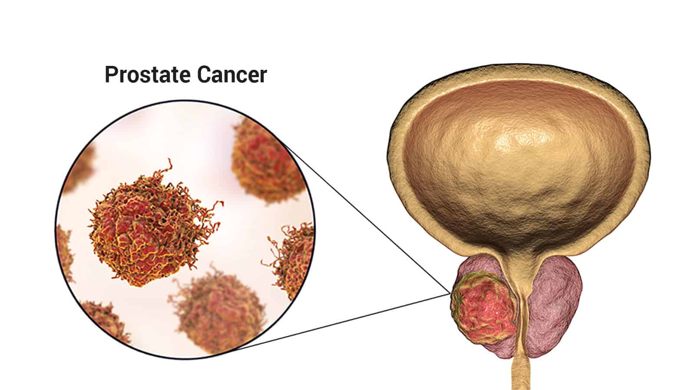
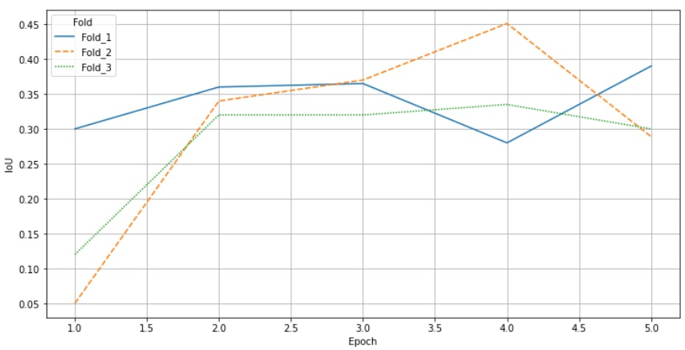

# АНАЛИЗ ИЗОБРАЖЕНИЙ ТРУЗИ ПРОСТАТЫ С ИСПОЛЬЗОВАНИЕМ МЕТОДОВ МАШИННОГО ОБУЧЕНИЯ

## Содержание

<!--ts-->

   * [Установка пакетов и зависимостей](#1-Установка-пакетов-и-зависимостей)
   * [Структура проекта](#2-Структура-проекта)
   * [Описание задачи](#3-Описание-задачи)
   * [Описание данных](#4-Описание-данных)
   * [Разметка](#5-Разметка)
   * [Обработка данных](#6-Обработка-данных)
   * [Обучение](#7-Обучение)
   * [Инференс](#8-Инференс)

<!--te-->

## 1. Установка пакетов и зависимостей
Необходимо открыть окно командной строки и ввести туда следующие команды:
```bash
  pip install -r requirements.txt
  pip install -e .
```
## 2. Структура проекта

```bash
.
├── application                                                                               <-- 
│   ├── src                                                                                                 <-- 
│   ├── application.py   <-- Скрипт приложения
│   └── inference.py  <-- Инициализация нейронной сети и работы со входными изображениями
├── inference_ONNX                                                                                          <-- 
│   ├── model                                                                      <-- Директория для загрузки весов обученной модели
│   ├── cli                                                         <-- 
│   │   ├── __init__.py
│   │   ├── src
│   │   ├── inference.py  <-- Инициализация нейронной сети и работы со входными изображениями
│   │   └── segment.py                                              <-- Обработка изображений нейронной сетью
│   └── web
│       ├── __init__.py
│       ├── api_tests.py <-- Тестирование API
│       ├── api.py <-- Поднятие сервера, использующего нейронную сеть
│       └── inference.py <-- Инициализация нейронной сети и работы со входными изображениями
├── inference_PyTorch                                                                                          <-- 
│   ├── model                                                                      <-- Директория для загрузки весов обученной модели
│   ├── cli                                                         <-- 
│   │   ├── __init__.py
│   │   ├── src
│   │   ├── inference.py  <-- Инициализация нейронной сети и работы со входными изображениями
│   │   └── segment.py                                              <-- Обработка изображений нейронной сетью
│   └── web
│       ├── __init__.py
│       ├── api_tests.py <-- Тестирование API
│       ├── api.py <-- Поднятие сервера, использующего нейронную сеть
│       └── inference.py <-- Инициализация нейронной сети и работы со входными изображениями
├── src
│   ├── __init__.py
│   ├── base
│   │   ├── __init__.py
│   │   ├── heads.py
│   │   ├── initialization.py
│   │   ├── model.py
│   │   └── modules.py
│   ├── decoders
│   │   ├──
│   ├── encoders
│   │   ├──
│   └── utils
│       ├── __init__.py
│       ├── dataset.py   <-- Класс формирования датасета и обработки данных
│       ├── functional.py   <-- Классы наборов метрик
│       ├── losses.py   <-- Классы функций потерь
│       ├── meter.py   <-- Класс промежуточных вычислений метрик
│       ├── metrics.py   <-- Классы инициализации метрик
│       ├── plotting.py   <-- Визуализация работы с входными и выходными данными
│       ├── train.py   <-- Классы обучения и валидации модели
│       └── base.py   <-- Классы работы с функциями потерь
├── create_dataframe.ipynb                                                            <-- Преобразование сырых данных в данные для разметки
├── gen_data_png.ipynb                                                              <-- Преобразование сырых данных в данные для разметки
├── training.ipynb                                                                  <-- Ноутбук обучения модели на наборе данных
├── training.py                                                                     <-- Скрипт обучения Unet для приложения
├── README.md
├── requirements.txt                                                                                    <-- Требования по пакетам
├── training_kfold.ipynb                                                                          <-- Ноутбук обучения модели по фолдам
└── transformer.ipynb                                                                                         <-- Скрипт обучения трансформера SegformerForSemanticSegmentation
```
## 3. Описание задачи
<div style="text-align: justify">&emsp;В этом проекте мы стремимся обучить глубокую нейронную сеть для точной сегментации раковых опухолей на ультразвуковых изображениях. Сеть будет обучена на наборе аннотированных изображений и будет использовать сверточную нейросеть для извлечения характеристик и составления прогнозов.<br />
&emsp;Первым шагом в процессе обучения является предварительная обработка данных, которая включает изменение размера изображений до стандартного размера, нормализацию значений пикселей и разделение данных на обучающий, проверочный и тестовый наборы.
Далее мы будем использовать архитектуру нейронной сети UnetPlusPlus. Она будет учиться извлекать из изображений такие характеристики, как информация о краях и текстуре.<br />
&emsp;Затем сеть будет обучена с помощью функции потерь, которая измеряет разницу между предсказанной и фактической масками сегментации. Мы будем использовать Adam в качестве оптимизатора и будем следить за производительностью на проверочном множестве, чтобы предотвратить чрезмерную подгонку.<br />
&emsp;После обучения сети мы оценим ее работу на тестовом множестве, чтобы определить ее точность и устойчивость. Если результаты будут удовлетворительными, мы будем использовать обученную сеть для выводов на новых, еще не полученных ультразвуковых изображениях, чтобы предсказать наличие и расположение раковых опухолей. </div><br />
Этапы:
  * Получение данных
  * Разметка
  * Обработка изображений
  * Создание модели
  * Обучение
  * Тесты
  * Создание образа backend
  * Создание приложения

## 4. Описание данных
На момент обучения общий объем изображений составлял 136 снимков, из них:
  * 96 снимков обучения
  * 40 снимков тест

## 5. Разметка
Для разметки изображений использовался сервис Roboflow. Чтобы получить изображения для обучения, необходимо было папку с полученными в процессе диагностики снимками загрузить в директорию проекта, прописать пути в файле create_dataframe.ipynb и запустить скрипт, далее мы получаем папку data с преобразованными в нужный формат снимками, после этого загружаем данные в сервис Roboflow и размечаем. Затем, размеченные данные помещаем в директорию проекта в ту же папку data вместо ее содержимого.

## 6. Обработка данных
Для повышения эффективности модели были использованы следующие преобразования снимков:
  * Вырез участка изображения и ресайз до 768х768
  * Интерполяция
  * Изотропный диффузионный фильтр

## 7. Обучение
Для обучения модели интегрированной в приложение была выбрана архитектура Unet Plus Plus. Основание: легкость модели и возможность запускать ее на низкомощных компьютерах.<br />
Энкодер - resnet152<br />
Функция оптимизации - комбинированный DiceLoss и BCELoss<br />
Метрика валидации - IoU<br />
Оптимизатор - Adam<br />
Планировщик обучения - ReduceLROnPlateau

## 8. Инференс
Сохранение модели с лучшими результатами на валидации


## х. Результаты

Метрика IoU:
  * Валидация = 0.44
  * Тест = 0.3